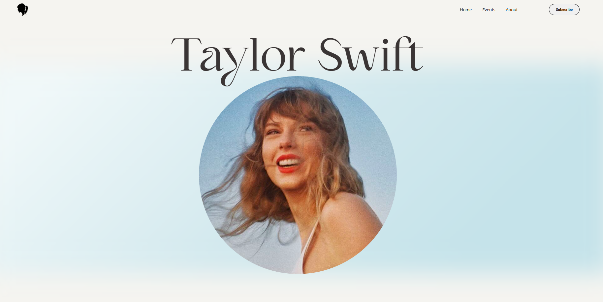

# Landing Page – 1989 (Taylor's Version)
 

Uma landing page desenvolvida com React para homenagear o álbum **1989 (Taylor’s Version)** da Taylor Swift.  
Este projeto foi criado como prática de front-end e faz parte do meu portfólio pessoal. 

## Preview

## Funcionalidades

- Design responsivo com CSS customizado
- Conteúdo visual inspirado na era 1989 (Taylor’s Version)
- Estética personalizada com cores, fontes e imagens do álbum

## Tecnologias utilizadas

- [React.js](https://reactjs.org/)
- [Vite](https://vitejs.dev/)
- HTML5 + CSS3 (customizados, sem frameworks)
- JavaScript (ES6+)

## Instalação

1 - Clone o projeto:

`git clone https://github.com/Nicole260205/taylor-swift-landing-page-1989.git`  

2 - Acesse a pasta:

`cd taylor-swift-landing-page-1989`  

3 - Instale as dependências:

`npm install`

4 - Execute localmente:

`npm run dev`

Acesse: http://localhost:5173

## Autora
Feito por @Nicole260205